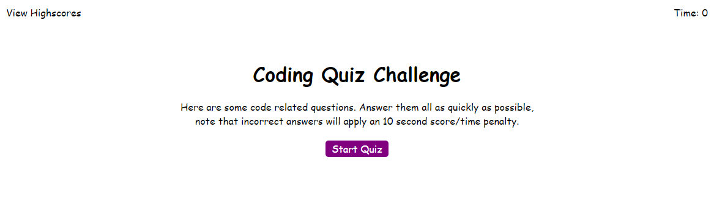

# Coding-Quiz
Here's a quiz about coding. Super fun stuff.

## Screenshots

## User Story
AS A coding boot camp student
I WANT to take a timed quiz on JavaScript fundamentals that stores high scores
SO THAT I can gauge my progress compared to my peers

## Table of Contents 
1. [About the Project](#About-The-Project)
1. [Project Links](#Project-Links)
1. [Deployed App](#Deployed-App)
1. [Project Team](#Project-Team)
1. [Questions](#Questions)

## About The Project
GIVEN I am taking a code quiz
- WHEN I click the start button  
THEN a timer starts and I am presented with a question
- WHEN I answer a question 
THEN I am presented with another question
- WHEN I answer a question incorrectly 
THEN time is subtracted from the clock
- WHEN all questions are answered or the timer reaches 0 
THEN the game is over
- WHEN the game is over 
THEN I can save my initials and score

## Project Links
[Repo Link](https://github.com/Kawilder/Coding-Quiz)  

## Deployed App
[GH-Pages](https://kawilder.github.io/Coding-Quiz/)

## Project Team
[Kevin Wilder](https://github.com/Kawilder)  

## Questions

    
Contact

    kevin_wilde564@yahoo.com

